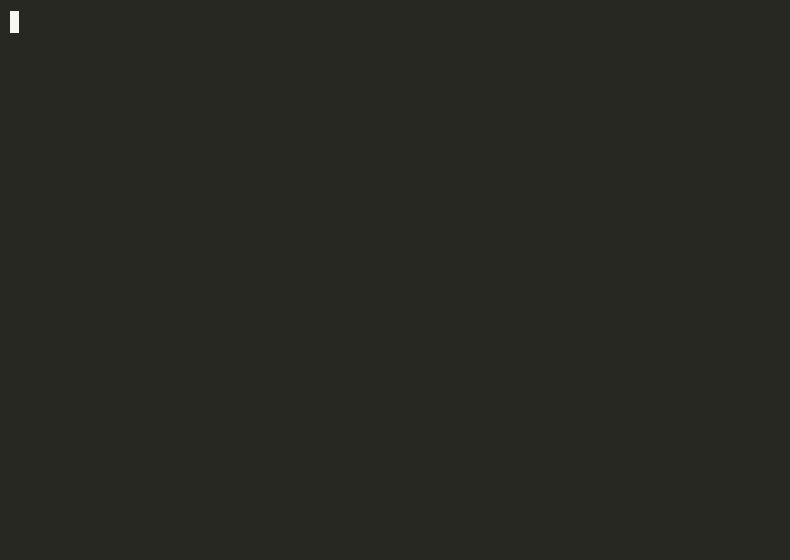

<p align="center">
  
</p>

<h1 align="center">Relay</h1>

<p align="center">
  <strong>The integration layer for AI agents.</strong><br/>
  One catalog for every tool, shared across every agent you use.
</p>

<p align="center">
  <a href="https://www.npmjs.com/package/relay"></a>
  <a href="https://github.com/gothamdev244/relay/blob/main/LICENSE"></a>
  <a href="https://discord.gg/eF29HBHwM6"></a>
</p>

---

<p align="center">
  
</p>

Relay is an open-source runtime that unifies your integrations — OpenAPI, GraphQL, MCP, and Google Discovery — into a single tool catalog. Connect once, use everywhere: from Claude Code and Cursor to custom agents built with the SDK.

## Architecture

<p align="center">
  
</p>

## Quick Start

```bash
npm install -g relay
relay web
```

Opens a local runtime with a web UI at `http://127.0.0.1:4788`. Add your first source and start using tools.

### Use as an MCP Server

Point any MCP-compatible agent at Relay to share your tool catalog, auth, and policies across all of them.

```bash
relay mcp
```

Example `mcp.json` for Claude Code / Cursor:

```json
{
  "mcpServers": {
    "relay": {
      "command": "relay",
      "args": ["mcp"]
    }
  }
}
```

## SDK

Three entry points — pick the one that fits:

| Import                  | Use case                                                          |
| ----------------------- | ----------------------------------------------------------------- |
| `@relay-sh/sdk`         | Promise-based. Scripts, quick integrations, non-Effect codebases. |
| `@relay-sh/sdk/core`    | Effect-native. Full type safety, streaming, composable pipelines. |
| `@relay-sh/sdk/testing` | Mocks and utilities for writing tests against your tools.         |

```ts
import { createRelay } from "@relay-sh/sdk";

const relay = await createRelay();

await relay.openapi.addSpec({
  url: "https://petstore3.swagger.io/api/v3/openapi.json",
});

const tools = await relay.tools.list();
console.log(tools);

await relay.close();
```

## Adding Sources

Relay has first-party support for **OpenAPI**, **GraphQL**, **MCP**, and **Google Discovery**. The plugin system is open to any source type.

### Web UI

Open `http://127.0.0.1:4788` → **Add Source** → paste a URL. Relay detects the type, indexes tools, and handles auth.

### CLI

```bash
relay call relay openapi addSource '{
  "spec": "https://petstore3.swagger.io/api/v3/openapi.json",
  "namespace": "petstore",
  "baseUrl": "https://petstore3.swagger.io/api/v3"
}'
```

## Using Tools

### Programmatic

```ts
const matches = await tools.discover({ query: "github issues", limit: 5 });

const detail = await tools.describe.tool({
  path: matches.bestPath,
  includeSchemas: true,
});

const issues = await tools.github.issues.list({
  owner: "vercel",
  repo: "next.js",
});
```

### CLI

```bash
relay tools search "send email"
relay call github issues create '{"owner":"octocat","repo":"Hello-World","title":"Hi"}'
relay call gmail send '{"to":"alice@example.com","subject":"Hi"}'
```

If an execution pauses for auth or approval:

```bash
relay resume --execution-id exec_123
```

## CLI Reference

```
relay web                               Start runtime + web UI
relay daemon run | status | stop        Manage background daemon
relay mcp                               Start MCP endpoint
relay call <path...> '{"k":"v"}'        Invoke a tool by path
relay call <path...> --help             Browse namespaces and methods
relay resume --execution-id <id>        Resume paused execution
relay tools search "<query>"            Search tools by intent
relay tools sources                     List sources + tool counts
relay tools describe <path>             Show tool schema
```

## Project Structure

```
apps/
  cli/            CLI (relay command)
  local/          Local runtime server
  cloud/          Hosted service
  desktop/        Desktop app
  marketing/      relay.sh website

packages/
  core/
    sdk/          Core contracts, plugin wiring, scopes, policies
    execution/    Execution engine
    config/       Configuration and scope management
    storage-*/    Storage adapters
  plugins/
    openapi/      OpenAPI plugin
    graphql/      GraphQL plugin
    mcp/          MCP plugin
    google-*/     Google Discovery plugin
  kernel/
    quickjs/      QuickJS sandboxed runtime
    deno/         Deno subprocess runtime
    ir/           IR compiler
  react/          React UI components
  hosts/
    mcp/          MCP host surface
```

## Development

```bash
bun install
bun run dev
```

Dev server starts at `http://127.0.0.1:4788`.

```bash
bun run test          # run tests
bun run lint          # oxlint
bun run typecheck     # type checking
bun run format        # oxfmt
```

See [CONTRIBUTING.md](CONTRIBUTING.md) for full setup instructions.

## License

[MIT](LICENSE)
